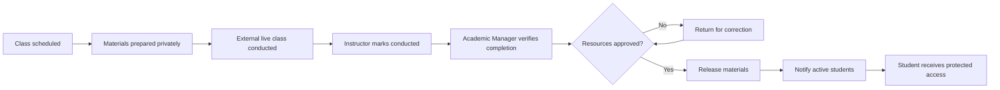

# Phase 0.3 — Core User Journeys

## Journey 1 — Staff creates a course and batch

**Primary actor:** Academic Manager  
**Outcome:** A batch with an editable syllabus and class schedule is ready for enrolment.

1. Academic Manager creates or selects a course.
2. Manager builds or selects a reusable syllabus template.
3. Manager creates a batch with code, dates, instructor, capacity, and status.
4. Drive the Market copies the syllabus into the batch.
5. Manager assigns dates and instructors to class sessions.
6. Manager reviews the calendar and publishes the batch schedule.

**Exceptions:** Missing syllabus, duplicate batch code, class outside batch dates, instructor conflict, or invalid capacity.

## Journey 2 — Administrator registers and enrols a student

**Primary actor:** Administrator  
**Outcome:** A student receives an account and active access to the correct batch.

1. Administrator searches by email and phone to prevent duplication.
2. Administrator creates a new student or selects an existing student.
3. Administrator selects a batch and sets access dates.
4. Drive the Market validates capacity and duplicate enrolment.
5. Administrator activates the enrolment.
6. Drive the Market sends an account invitation or enrolment notification.
7. Student sets a password and signs in.

**Exceptions:** Duplicate email, batch full, enrolment already exists, access dates invalid, or email delivery fails.

## Journey 3 — Bulk student import

**Primary actor:** Administrator  
**Outcome:** Valid students are imported with clear visibility of rejected rows.

1. Administrator downloads the import template.
2. Administrator uploads a CSV/Excel file.
3. Drive the Market validates fields, duplicates, batch, and dates without committing data.
4. Administrator reviews valid rows, warnings, and errors.
5. Administrator confirms the import.
6. Drive the Market creates students/enrolments in a transaction and produces a result report.

**Exceptions:** Invalid columns, duplicate records, unknown batch, partial failure, or capacity exceeded.

## Journey 4 — Prepare learning materials before class

**Primary actors:** Instructor or Content Manager  
**Outcome:** Materials are ready for review but unavailable to students.

1. User opens an assigned class.
2. User uploads documents, adds links, or registers a video asset.
3. User enters title, description, order, and download settings.
4. Drive the Market validates and stores the resource privately.
5. User previews the resource.
6. User submits the resource for academic review.
7. Academic Manager approves or returns it with feedback.

**Security rule:** No draft, review, or approved-but-unreleased resource URL is usable by a student.

## Journey 5 — Complete class and release materials

**Primary actors:** Instructor and Academic Manager  
**Outcome:** Eligible students receive protected access after the external class.

1. Instructor marks the class as conducted and records actual date/time.
2. Academic Manager verifies the class and available resources.
3. Manager marks the class completed.
4. Drive the Market checks that selected resources are approved.
5. Manager confirms release.
6. Drive the Market creates the release event and audit entry.
7. Active enrolled students receive in-app and email notifications.
8. Protected access becomes available immediately.

**Exceptions:** Class not conducted, unapproved resources, no active enrolments, video processing incomplete, or notification failure. Notification failure must not roll back a valid release.

## Journey 6 — Student learns after class

**Primary actor:** Student  
**Outcome:** Student consumes released content and progress is stored.

1. Student signs in and sees newly released material.
2. Student opens the batch and class.
3. Drive the Market verifies the active enrolment and release state.
4. Student opens a document or starts a video.
5. Drive the Market records activity and periodically saves video position.
6. Student resumes later from the saved position.
7. Progress rolls up from resource to class, module, and course.

**Exceptions:** Enrolment suspended/expired, resource re-locked, signed URL expired, video temporarily unavailable, or progress-save network failure.

## Journey 7 — Emergency re-lock

**Primary actor:** Academic Manager or Super Admin  
**Outcome:** Incorrect or sensitive content is immediately unavailable and the action is traceable.

1. Authorized user selects a released resource or class.
2. User selects Re-lock and enters a mandatory reason.
3. Drive the Market requests confirmation.
4. Drive the Market revokes new access and updates the release state.
5. Drive the Market writes an immutable audit event.
6. Affected staff are notified.

## Journey 8 — Public visitor submits an enquiry

**Primary actor:** Public visitor  
**Outcome:** A valid enquiry is stored and reaches administrators.

1. Visitor views a course or upcoming batch.
2. Visitor opens the enquiry form.
3. Visitor provides contact information, course interest, and message.
4. Drive the Market performs validation and spam protection.
5. The enquiry is stored and administrators are notified.
6. Administrator updates enquiry status and notes after follow-up.

## Journey 9 — Staff reviews engagement

**Primary actor:** Academic Manager or Administrator  
**Outcome:** Staff can identify students needing follow-up.

1. User opens progress reports and selects a batch/date range.
2. Drive the Market shows release access, video progress, last activity, and completion.
3. User filters inactive or low-progress students.
4. User exports the authorized report or creates a batch announcement.
