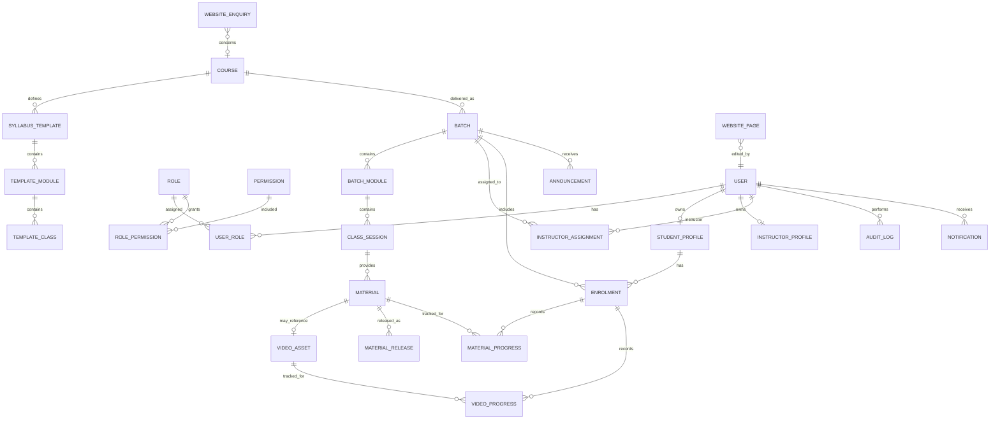

# Phase 0.4 — Initial Domain Model

## Entity relationship overview



## Aggregate boundaries

### Identity aggregate

Users, roles, permissions, profiles, accounts, and sessions. Authorization policies consume this aggregate but feature modules must not duplicate role logic.

### Course-template aggregate

A reusable course syllabus with ordered modules and class templates. Published templates are versioned or copied; changes must not silently rewrite active batches.

### Batch aggregate

A scheduled course delivery containing its own modules, class sessions, instructor assignments, and enrolments.

### Learning-content aggregate

Class materials, private storage references, video records, approval state, release events, and re-lock state.

### Progress aggregate

Student activity scoped through an enrolment. Progress remains historically attributable even after a batch completes.

## Important state models

### Enrolment

```text
Pending → Active → Completed
             ├── Suspended → Active
             └── Cancelled
```

Access requires `Active` plus valid access dates.

### Class session

```text
Draft → Scheduled → Conducted → Completed → Released
            ├── Rescheduled
            └── Cancelled
```

Released is a convenient class-level state; individual resource release history remains separate.

### Material

```text
Draft → In Review → Approved → Released → Archived
            └── Changes Requested → Draft
Released → Re-locked → Approved
```

## Data constraints

- User email is unique after normalization.
- Course code and batch code are unique within the institution.
- A student cannot have duplicate enrolments in the same batch.
- Module and class display positions are unique within their parent.
- Progress is unique per enrolment and material/video.
- A released resource must reference an approved material and completed class.
- Audit records are append-only from the application.
- Storage object identifiers are private and are not public URLs.
- Soft deletion or archival is preferred for academic records referenced by history.

## Open modelling questions

1. Does a batch ever combine multiple courses?
2. Can a class be shared across two batches?
3. Can one class have multiple instructors?
4. Is a separate material approval mandatory?
5. Does payment status need a first-class entity later?
6. Must progress remain visible after enrolment expiry?
7. Is class attendance needed for future release or certification logic?
